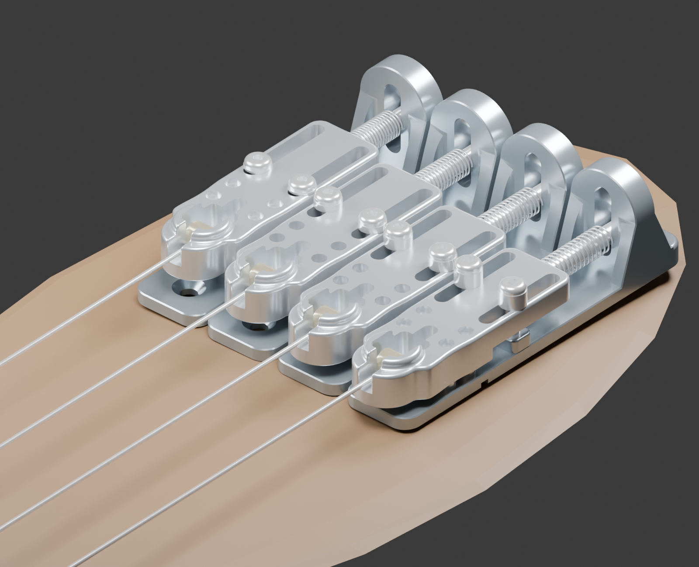
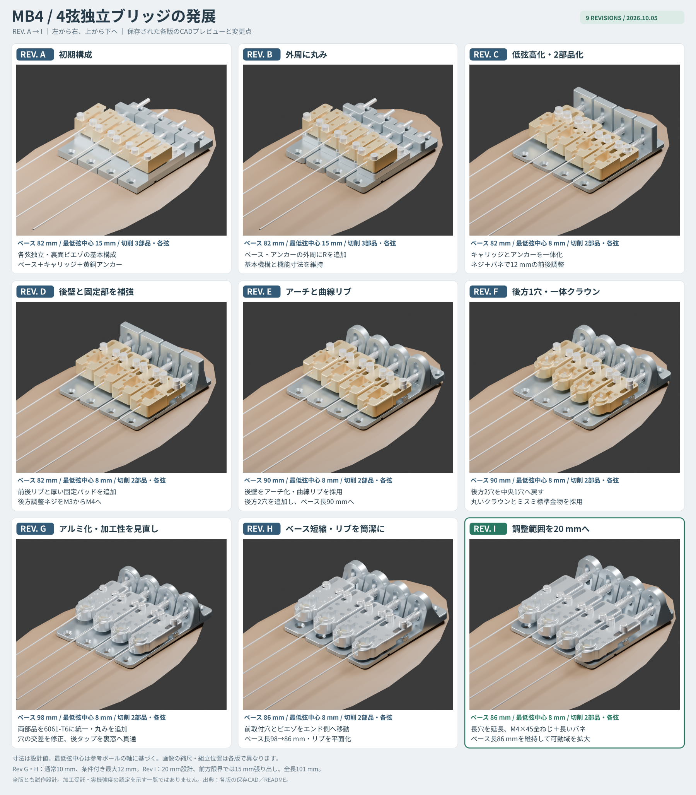

# MB4 — 各弦独立・ピエゾ対応の4弦ベース用ブリッジ

4弦ベースのブリッジを、**1弦ずつ独立したアルミ切削部品と市販ステンレス金物**で構成する試作設計です。各弦に裏面ピエゾを追加でき、高さとオクターブを個別に調整できます。球端から弦を伸ばす構成はRay Rossを参考にしています。

This repository documents a prototype four-string bass bridge with independent modules, optional per-string piezo pickups, adjustable height, and 20 mm of intonation travel. It includes CNC STEP files, drawings, hardware lists, reproducible CAD sources, and the complete Rev A–I design history. Documentation is primarily in Japanese; the current shop drawings and quotation brief are in English.

**最新版はRev Iです。** 汎用Jazz Bass／Precision Bass系を想定していますが、既存のFender系5穴への互換設計ではありません。取付位置は実機で決める、新規穴あけ用の試作です。CADの形状・干渉を確認した段階で、実機強度・耐久性・音響とJLC CNCの正式な加工受託は未確認です。



## まず読む資料

| 知りたいこと | 資料 |
| --- | --- |
| 仕組み・寸法・設計の狙い | [設計説明](docs/design.md) |
| 組立・弦高・オクターブ調整 | [組立と調整](docs/assembly.md)、[図入りガイド](revisions/I/pdf/MB4_RevI_guide.pdf) |
| CNCの見積・発注に使うファイル | [加工と調達](docs/manufacturing.md) |
| Rev AからIまでの変更 | [開発履歴](docs/revision-history.md) |
| 確認済みの範囲と残る評価 | [検証記録](docs/validation.md) |
| ソースからSTEPなどを作り直す | [再生成手順](docs/reproduction.md) |

## Rev Iの主要仕様

| 項目 | 設計値・構成 |
| --- | --- |
| 弦数・弦間 | 4弦、19 mmピッチ、全幅75 mm |
| 機械加工部品 | B07ベース＋A07アンカー、各弦2部品・合計8部品 |
| 材質 | 両部品ともアルミ6061-T6 |
| 各ベースの外形 | 幅18 × 長さ86 × 最大高さ25 mm |
| アンカーの外形 | 幅18 × 長さ55 × 最大高さ10 mm |
| 参考弦中心高さ | ボディ表面から8〜20 mm。球端と巻き部の実物で変わる |
| オクターブ調整 | 20 mm連続、中央から前後各10 mm |
| 高さ・固定金物 | M4平先4本／弦、M3固定ねじ2本／弦 |
| 後方調整 | M4×45全ねじ＋UY6-35圧縮ばね |
| ボディ固定 | 前1穴＋後1穴／弦、合計8穴 |
| ピエゾ | 各弦裏面にφ12以下、接着・配線込み厚さ1.2 mm以下を想定 |

**ベース板の長さ86 mmと、可動部を含む全長は別です。** 前方限界ではアンカーが15 mm張り出し、モジュール全長は101 mmになります。

## ダウンロードと加工用データ

- [Rev I JLC見積用ZIP](downloads/MB4_JLCCNC_upload_RevI.zip)：B07とA07の単品STEP＋対応する英文加工図。各4個。
- [Rev I 6面プレビューZIP](downloads/MB4_RevI_six_views.zip)：同倍率の正投影画像。
- [Releases](https://github.com/Bongorian/mb4-independent-bass-bridge/releases)：Blenderモデルなどを含む元のRev Iフルパッケージも配布。
- [B07ベースSTEP](revisions/I/cad/step/B07_long_travel_base.step)／[B07加工図](revisions/I/pdf/B07_long_travel_base.pdf)
- [A07アンカーSTEP](revisions/I/cad/step/A07_long_travel_anchor.step)／[A07加工図](revisions/I/pdf/A07_long_travel_anchor.pdf)
- [部品表](revisions/I/BOM.csv)、[ミスミ購入候補](revisions/I/MISUMI_purchase_options.csv)、[原寸取付DXF](revisions/I/MB4_mount_template_1to1.dxf)

加工に提出するのは**Rev Iの単品STEPと同名の加工図**です。組立STEP・STL・外観画像は参考資料です。STEPのねじ穴は下穴径なので、加工図のタップ指示も必要です。旧版と最新版の部品・図面を混ぜないでください。

## Rev A〜Iの発展



[高解像度の一覧PNG](docs/assets/revision-history.png) ／ [変更点の詳細](docs/revision-history.md)

## リポジトリ構成

```text
README.md              プロジェクトの入口と最新版へのリンク
docs/                  設計・組立・加工・検証・履歴の説明
docs/assets/           Rev A〜Iの一覧画像
revisions/A/ ... I/    各版の保存STEP・PDF・ソース・部品表・プレビュー
downloads/             Rev Iの見積用ZIPと6面画像ZIP
tools/                 整合性確認と一覧画像の再生成
```

過去版は開発記録です。各フォルダの元READMEは当時の寸法・判断を保存しています。現行のファイル構成や発注手順はこのREADMEと`docs/`を参照してください。大きなBlenderファイル、再生成できるSTL、作業ログ、ローカルPython環境はGitの管理対象から外しています。

更新日：2026-10-05。試作の実物評価・加工先の審査結果が出たら、対応する改訂版として記録する想定です。
