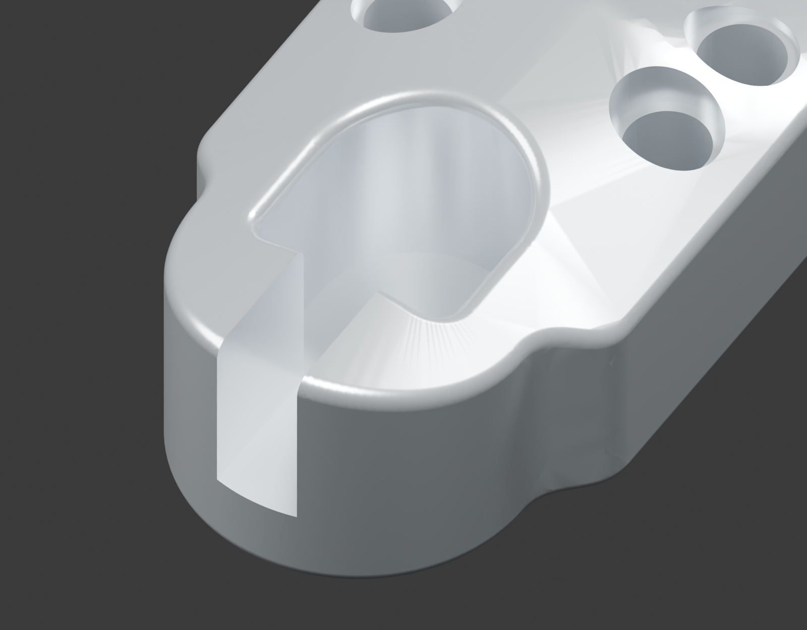
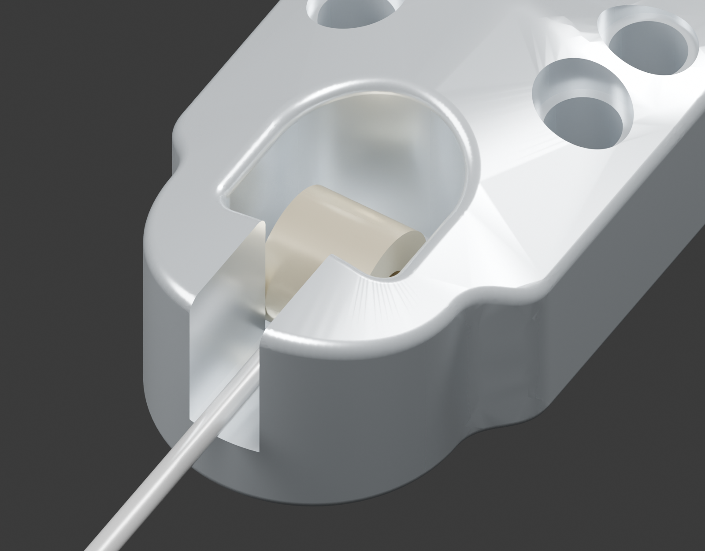
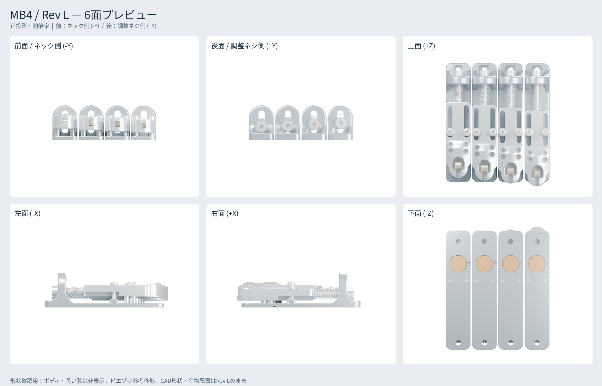

# 設計説明 — MB4 Rev L

## 何を作る設計か

MB4は、4弦ベースの各弦を独立したブリッジモジュールで保持する試作設計です。複雑な専用金物を増やさず、アルミ部品2種類と市販のねじ・座金・圧縮ばねで、高さ・オクターブ調整とピエゾ取付を成立させることを目的としています。

弦間は19 mm、各ベース幅18 mmなので、隣のベースとの間に1 mmあります。中央の弦間基準に対する各弦のX座標は−28.5、−9.5、9.5、28.5 mmです。

## 1弦分の構成

| 構成要素 | 役割 |
| --- | --- |
| B10ベース | 木部へ固定する板、調整ねじを受ける後壁、リブ、固定ねじのパッド、裏面ピエゾ窪み |
| A10アンカー | 凸上面とカプセル状の球端保持部、弦の逃げ、前後移動用長穴、高さねじ、後方M4タップ |
| M4平先4本 | アンカーをベース上に支持し、高さを変える |
| M3固定ねじ2本 | 長穴を通して位置を固定する |
| 後方M4×45＋ばね | 前後位置を調整する。ねじを締めるとエンド側へ引き、緩めるとばねが前へ押す |
| 前後の木ねじ | モジュールをボディへ固定する |

Ray Rossの球端から弦を伸ばす構成を参考に、従来のサドルに相当する保持部を一体の保持部にしています。メーカー製品のtone pinと同じ機構・音響特性を再現したと確認した設計ではありません。実際の支点は球端・巻き部によって変わるため、実弦で評価します。

## ボールエンド保持部の再設計

Rev Lは、角丸四角形の窪みと後方へ延びる細溝を、一つのカプセル状の保持座へ整理しました。前には弦張力を受ける肩を残し、奥は大きな半円、上面との境界は実形状のR0.6でつなぎます。後方の不要な細溝をなくしたため、球端の後ろに連続した材料が残ります。

窪みの基準形状は幅8.2、Y6〜15、底Z2、前内隅R1.1、奥R4.1（中心Y10.9）です。前の保持肩はY6、幅6を前向きの幅3.4の弦出口で二分します。弦出口の底Z3.3は維持し、後方へは延ばしません。入口のRによる広がりはSTEPを参照します。

球端を上からY11へ入れ、前の肩へ寄せます。参考球端は外径6・横幅4.75の円筒、横軸X、着座中心Y9/Z5です。CADでは縦挿入とY11から9への移動、肩による前方への抜け止め、前方の弦出口を確認しました。弦張力で肩に保持する構成であり、球端を締め付ける追加のねじはありません。無張力で上方へ取り出せるため、完全な包囲や無張力時の脱落防止は保証しません。

実物の球端・巻き部の寸法と接触は未確定です。市販の全弦に対応するとの保証ではなく、使用弦で収まり・接触・弦高・必要なオクターブ補正を評価します。保持肩Y6と底Z2を保ち、参考弦高8〜20 mmと調整20 mmは維持しています。B10ベースはRev KのB09と同形状で、A10との組合せを明確にするため品番・版を揃えています。

## 低い弦高と調整域

ベース下面をZ0、主板上面をZ3とします。アンカー下面と主板上面の隙間を`g`とすると、参考弦中心は`H = 8 + g` mmです。`g = 0〜12`で参考高さ8〜20 mmになります。後壁の高さ25 mmは構造物の全高であり、最低弦高ではありません。

各アンカーの前端位置を、ベース前端Y0に対して`q`とします。Rev Lでは`q = −15〜5`、移動量20 mmです。中央は`q = −5`です。固定長穴は全長23.4 mm・幅3.4 mmで、M3軸中心が20 mm移動した両端に公称0.2 mmの余裕を持たせています。

Rev Iでベース長を増やさず可動域を広げるため、アンカー長を50→55 mm、後壁位置を7.5 mmエンド側へ移し、ネジ先端が移動できる裏面開放窓を延長しました。Rev Lでもその機構を維持しています。前方限界ではアンカーが15 mm張り出し、モジュール全長は101 mmです。ネック側の余白とピックガードとの干渉も取付時に確認します。

## 流線的な外形と穴の縁

Rev Kから継続して、丸い前部から低い後部へつながる一枚の上面を持ちます。前側は放物線の断面で、側端X±9/Z7.8、頂部X0/Z10.5です。Y21〜27.8で接線が滑らかにつながる面を使い、後部上面Z8へ下げます。独立した円柱クラウン、後部中央の盛り上がった筋と、個別の固定座の段差をなくしました。最高部は10.5 mm、弦の保持位置は維持するので参考最低弦高は8 mmです。

支柱は厚さ6の単純なR9アーチ、前後縁R1.2です。座金・ばねは前後の平面で受け、追加の座ボスを設けません。左右の3 mmリブは一続きの曲線で支えます。外稜線R0.8、内側縦根元R2、内稜線はC0.2 MAXのバリ取りです。曲線の詳細はSTEPを基準にします。根元下の装飾的な溝は作りません。

高さ穴をX±5.5/Y19・24へ移し、上側入口をφ4.2にしています。輪郭のくびれをなくし、外周・隣の穴・固定座へ入口が切れ込む形を避けました。床Z8から下面まで8 mmのM4ねじ領域を保ち、入口床周囲の0.5 mm材料と、タップ主径周囲の0.8 mm材料をCAD確認します。穴周辺の最終バリ取り・丸みは図面指示の範囲で行います。

必要な取付面・固定座・走行面・接着面は平面です。曲面仕上げが増えるため、加工費と工具到達性は手動見積審査で確認します。リブの曲線化後の荷重下剛性と疲労は未評価です。材料ガードのCAD確認を実物強度保証として扱いません。

## 各弦ピエゾ

ベース裏面の中心X0/Y24にφ12.5・深さ1.5 mmの窪みがあります。φ12以下の素子を金属面へ接着し、接着・配線を含めた厚さを1.2 mm以下にする想定です。木部と挟み込む構成ではありません。

4個の素子を各々の高インピーダンス入力・バッファへ接続する想定です。具体的なピエゾ品番と電子回路はこのリポジトリでは確定していません。機械的に独立したモジュールでも共通木部から振動が回り込むため、完全な弦間分離を保証しません。

## 座標と取付

各部品のX0は幅の中央、Y0はその部品のネック側前端、Z0は下面です。アンカーの寸法とベースの寸法はそれぞれの原点で記載します。アンカーをベースへ組むときはY方向へ`q`、Z方向へ`3 + g`移動します。

ベースの木ねじ中心はX0/Y8とX0/Y81、前後間隔73 mmです。既存ブリッジを交換する場合にも取付位置の実測が必要です。参考保持肩はベース座標で`Y = q + 6`です。最終位置は実弦、ネック、必要な補正量から決定してください。
