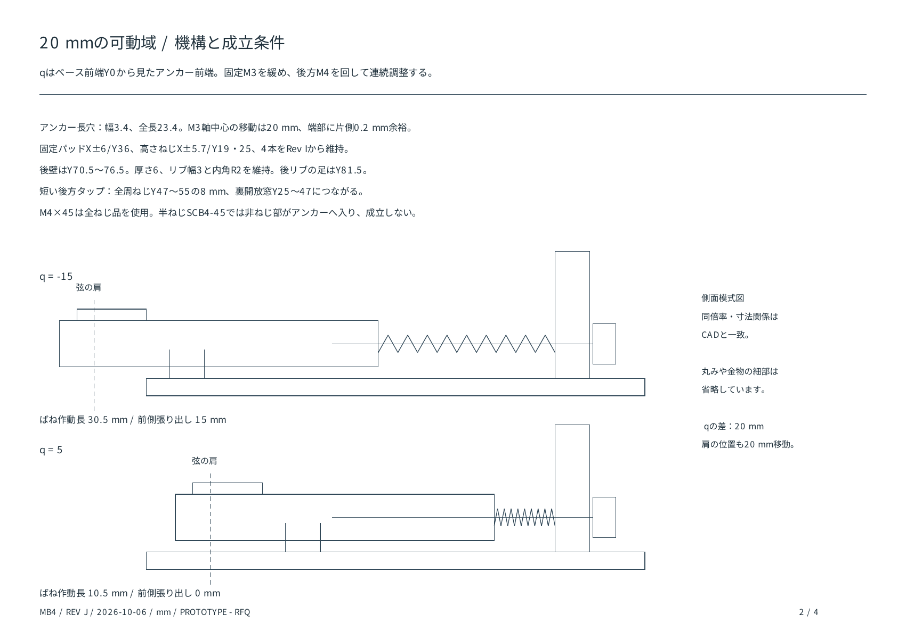

# 設計説明 — MB4 Rev J

## 何を作る設計か

MB4は、4弦ベースの各弦を独立したブリッジモジュールで保持する試作設計です。複雑な専用金物を増やさず、アルミ部品2種類と市販のねじ・座金・圧縮ばねで、高さ・オクターブ調整とピエゾ取付を成立させることを目的としています。

弦間は19 mm、各ベース幅18 mmなので、隣のベースとの間に1 mmあります。中央の弦間基準に対する各弦のX座標は−28.5、−9.5、9.5、28.5 mmです。

## 1弦分の構成

| 構成要素 | 役割 |
| --- | --- |
| B08ベース | 木部へ固定する板、調整ねじを受ける後壁、リブ、固定ねじのパッド、裏面ピエゾ窪み |
| A08アンカー | 球端保持クラウン、弦の逃げ、前後移動用長穴、高さねじ、後方M4タップ |
| M4平先4本 | アンカーをベース上に支持し、高さを変える |
| M3固定ねじ2本 | 長穴を通して位置を固定する |
| 後方M4×45＋ばね | 前後位置を調整する。ねじを締めるとエンド側へ引き、緩めるとばねが前へ押す |
| 前後の木ねじ | モジュールをボディへ固定する |

Ray Rossの球端から弦を伸ばす構成を参考に、従来のサドルに相当する保持部を一体クラウンにしています。メーカー製品のtone pinと同じ機構・音響特性を再現したと確認した設計ではありません。実際の支点は球端・巻き部によって変わるため、実弦で評価します。

## 低い弦高と調整域

ベース下面をZ0、主板上面をZ3とします。アンカー下面と主板上面の隙間を`g`とすると、参考弦中心は`H = 8 + g` mmです。`g = 0〜12`で参考高さ8〜20 mmになります。後壁の高さ25 mmは構造物の全高であり、最低弦高ではありません。

各アンカーの前端位置を、ベース前端Y0に対して`q`とします。Rev Jでは`q = −15〜5`、移動量20 mmです。中央は`q = −5`です。固定長穴は全長23.4 mm・幅3.4 mmで、M3軸中心が20 mm移動した両端に公称0.2 mmの余裕を持たせています。

Rev Iでベース長を増やさず可動域を広げるため、アンカー長を50→55 mm、後壁位置を7.5 mmエンド側へ移し、ネジ先端が移動できる裏面開放窓を延長しました。Rev Jでもその機構を維持しています。前方限界ではアンカーが15 mm張り出し、モジュール全長は101 mmです。ネック側の余白とピックガードとの干渉も取付時に確認します。

## 丸みと補強の扱い

アンカーには丸い先端、一体クラウン、外周Rを設けています。後壁はR9のアーチです。一方、左右のリブは幅3 mmの簡潔な平面形状を保ち、壁との内角R2、外側斜辺R0.8、内側斜辺R0.5を持ちます。アーチ前後縁はR1.2、自由な前板上縁はR0.5、アンカー上縁はR1.2・下縁はR0.6です。リブ根元の下に外周Rが入り込んで溝を作らない形です。

後側のリブの足は、Rev Iで調整範囲を確保する際に短縮した形を維持しています。厚さ・材料の連続性はCADで確認しましたが、本版の荷重下の剛性や疲労は未評価です。Rev D/Eの簡易断面比較をRev Jの強度保証として使いません。

## 各弦ピエゾ

ベース裏面の中心X0/Y24にφ12.5・深さ1.5 mmの窪みがあります。φ12以下の素子を金属面へ接着し、接着・配線を含めた厚さを1.2 mm以下にする想定です。木部と挟み込む構成ではありません。

4個の素子を各々の高インピーダンス入力・バッファへ接続する想定です。具体的なピエゾ品番と電子回路はこのリポジトリでは確定していません。機械的に独立したモジュールでも共通木部から振動が回り込むため、完全な弦間分離を保証しません。

## 座標と取付

各部品のX0は幅の中央、Y0はその部品のネック側前端、Z0は下面です。アンカーの寸法とベースの寸法はそれぞれの原点で記載します。アンカーをベースへ組むときはY方向へ`q`、Z方向へ`3 + g`移動します。

ベースの木ねじ中心はX0/Y8とX0/Y81、前後間隔73 mmです。既存ブリッジを交換する場合にも取付位置の実測が必要です。参考保持肩はベース座標で`Y = q + 6`です。最終位置は実弦、ネック、必要な補正量から決定してください。
